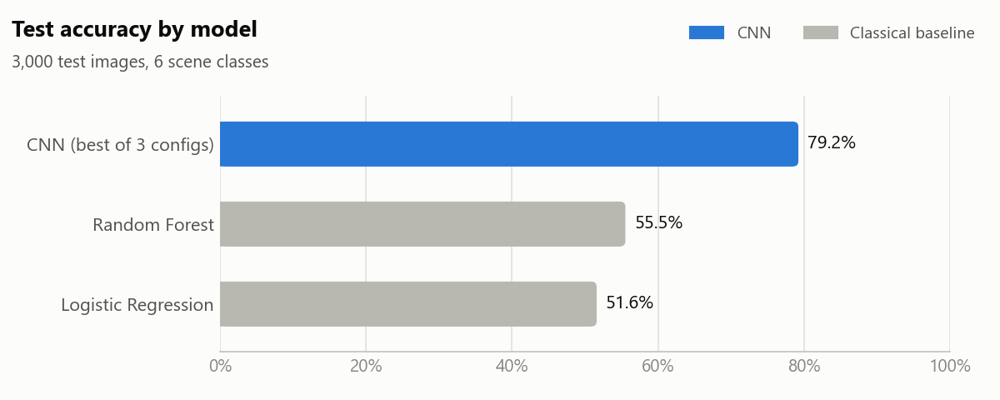
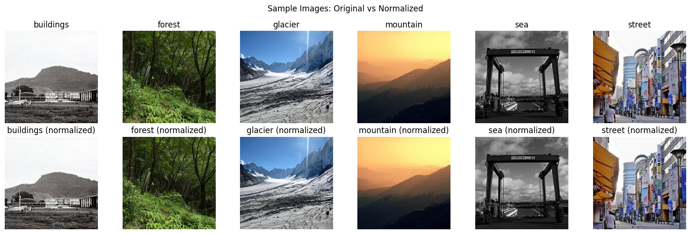
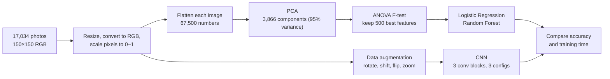

# Natural Scene Image Classification: CNN vs. Classical ML


Teaching a computer to recognise what kind of place a photo shows: **buildings, forest, glacier, mountain, sea or street**.
The project compares a **convolutional neural network (CNN)** with two **classical machine-learning models** and shows
how much a CNN gains, and what it costs in training time.

<picture>
  <source media="(prefers-color-scheme: dark)" srcset="images/accuracy-dark.png">
  
</picture>

## At a glance

| | |
|---|---|
| **Data** | 17,034 photos (14,034 train / 3,000 test), 150×150 px, 6 classes |
| **Best model** | CNN, **79.2 %** test accuracy |
| **Classical baselines** | Random Forest 55.5 %, Logistic Regression 51.6 % |
| **Trade-off** | CNN gains 24 percentage points but trains ~40× longer (~4 min vs ~6 s on CPU) |
| **Context** | NTNU course IT3212, Autumn 2025 |



## How it works



1. **Preprocessing:** every photo is resized to 150×150, converted from BGR to RGB and scaled to the 0–1 range.
2. **Classical baselines:** a photo is just a long list of 67,500 pixel values, too many for simple models.
   PCA compresses them to 3,866 components that keep 95 % of the information, and an ANOVA F-test then keeps the
   500 components that best separate the six classes. Logistic Regression and Random Forest are trained on those.
3. **CNN:** works on the images directly, learning visual patterns (edges, textures, shapes) itself.
   Training uses data augmentation (random rotation, shift, flip and zoom) so the network sees more variety.
4. **Hyperparameter tuning:** three CNN configurations were trained and compared:

| Config | Filters (block 1 / 2–3) | Dropout | Learning rate | Test accuracy | Training time |
|---|---|---|---|---|---|
| **1** | **32 / 64** | **0.3** | **0.001** | **79.2 %** | 244 s |
| 2 | 64 / 128 | 0.5 | 0.001 | 72.5 % | 588 s |
| 3 | 32 / 64 | 0.5 | 0.0005 | 79.2 % | 272 s |

CNN architecture: `Conv2D → MaxPool → Conv2D → MaxPool → Conv2D → MaxPool → Dense(512) → Dropout → Dense(6, softmax)`,
Adam optimizer, 5 epochs, batch size 32.

## Repository structure

```
├── natural_scene_classification.ipynb   # full pipeline with outputs
├── images/                              # charts and figures used in this README
├── requirements.txt
└── data/                                # dataset goes here (not included, see below)
```

> If GitHub doesn't display the notebook, open it on
> [nbviewer](https://nbviewer.org/github/EbrahimShirjazi/Natural-Scene-Image-Classification-CNN-vs-Classical-ML/blob/main/natural_scene_classification.ipynb).

## Run it yourself

1. Install the packages (TensorFlow needs Python 3.10–3.12):
   ```bash
   pip install -r requirements.txt
   ```
2. Download the [Intel Image Classification dataset](https://www.kaggle.com/datasets/puneet6060/intel-image-classification)
   from Kaggle and unzip it into `data/`, so that you have `data/seg_train/seg_train/<class>/` and `data/seg_test/seg_test/<class>/`.
3. Open `natural_scene_classification.ipynb` and run all cells. Training the three CNN configurations takes about
   20 minutes on a laptop CPU.

## Notes and limitations

- The test set was also used to pick the best CNN configuration, so 79.2 % is slightly optimistic.
  A separate validation split would give a fully unbiased estimate.
- Each CNN was trained for only 5 epochs to keep the run short; longer training would likely improve accuracy.

## Context

Built as part of a group assignment in the NTNU course IT3212 (Autumn 2025). The image-classification part in this
repository is my own work.

## Related projects

- [Multivariate-Retail-Demand-Forecasting](https://github.com/EbrahimShirjazi/Multivariate-Retail-Demand-Forecasting): forecasting daily sales with time-series features, ensembles and transfer learning
- [Retail-Data-Preprocessing-Pipeline](https://github.com/EbrahimShirjazi/Retail-Data-Preprocessing-Pipeline): cleaning and preparing the Favorita store-sales data
